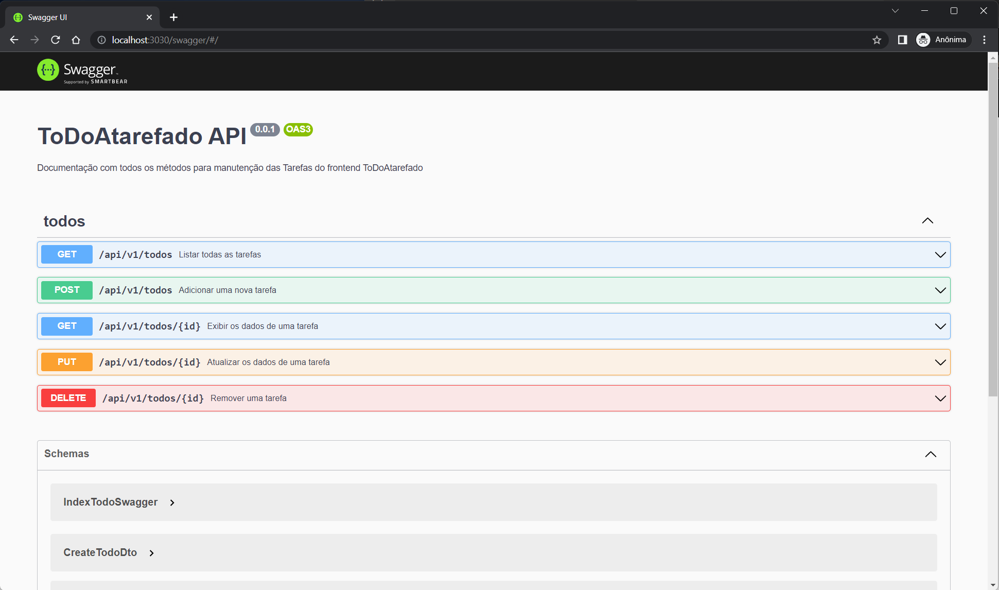

# ToDoAtarefado - Backend

## Descrição

Está api referece ao backend da aplicação ToDoAtarefado.

## Preview


## Antes da instalação

Subir um docker com banco de dados, o padrão utilizado foi Postgres, porém pode alterar e utilizar o banco relacional que desejar.

## Installation

```bash
$ npm install
```

## Principais comandos

```bash
# development
$ npm run start

# watch mode
$ npm run start:dev

# production mode
$ npm run start:prod
```

## Test

```bash
# unit tests
$ npm run test

# e2e tests
$ npm run test:e2e

# test coverage
$ npm run test:cov
```
